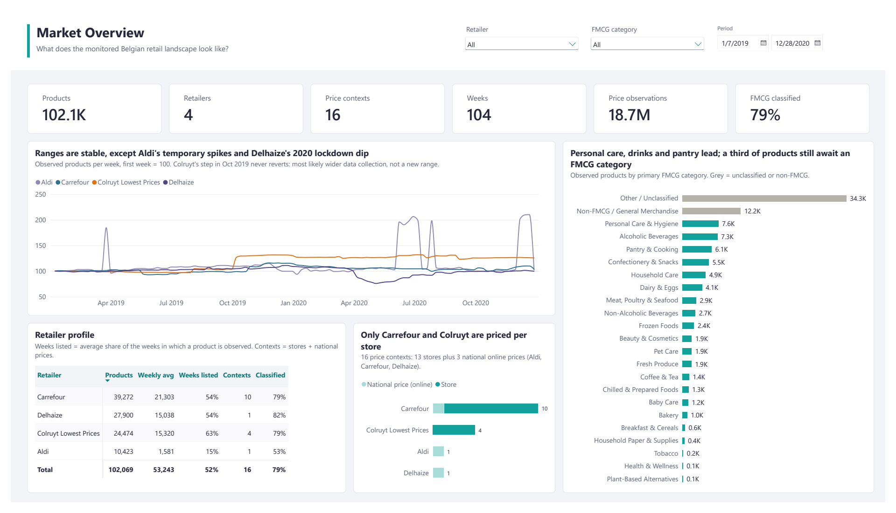
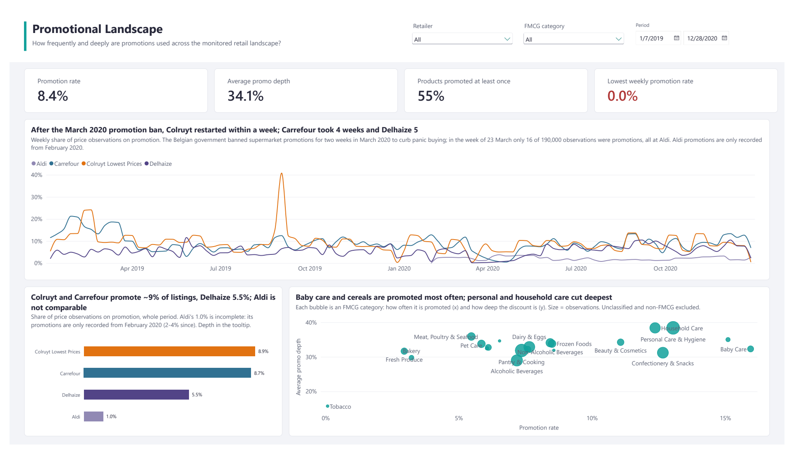
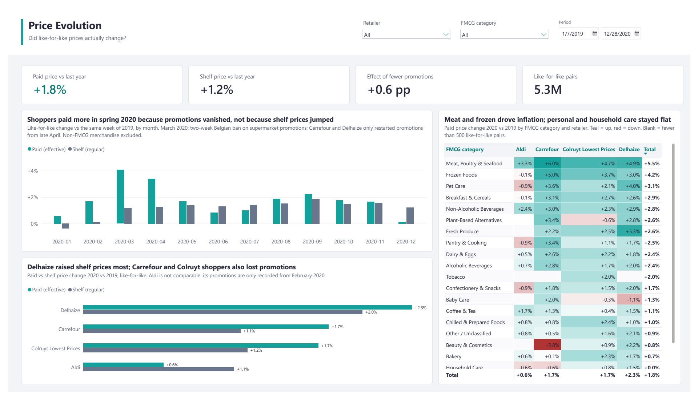
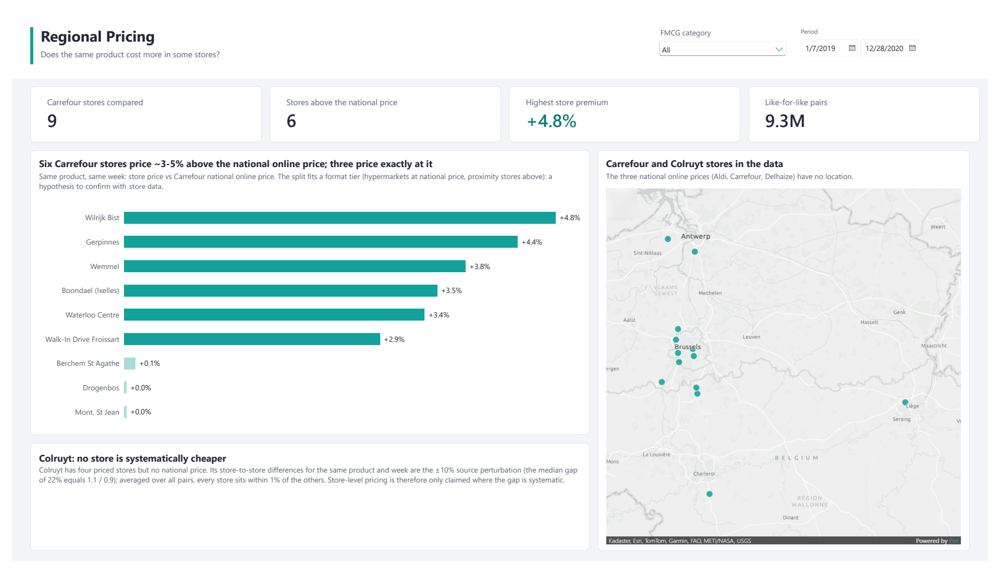
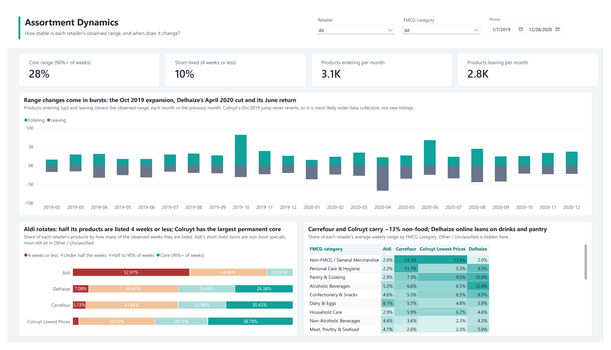
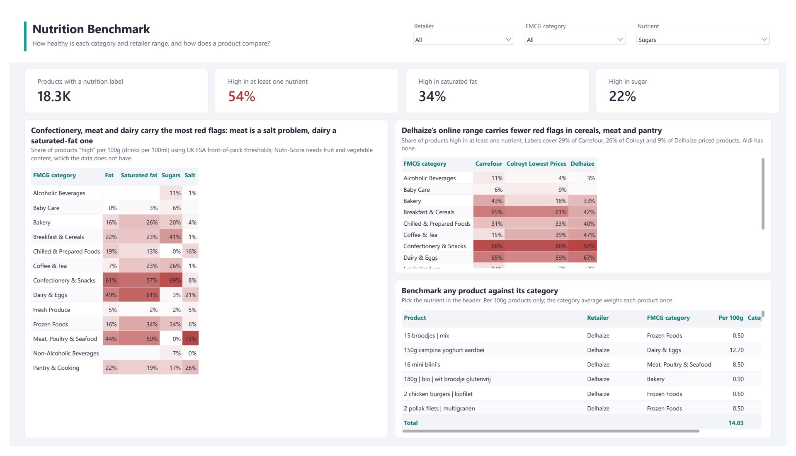
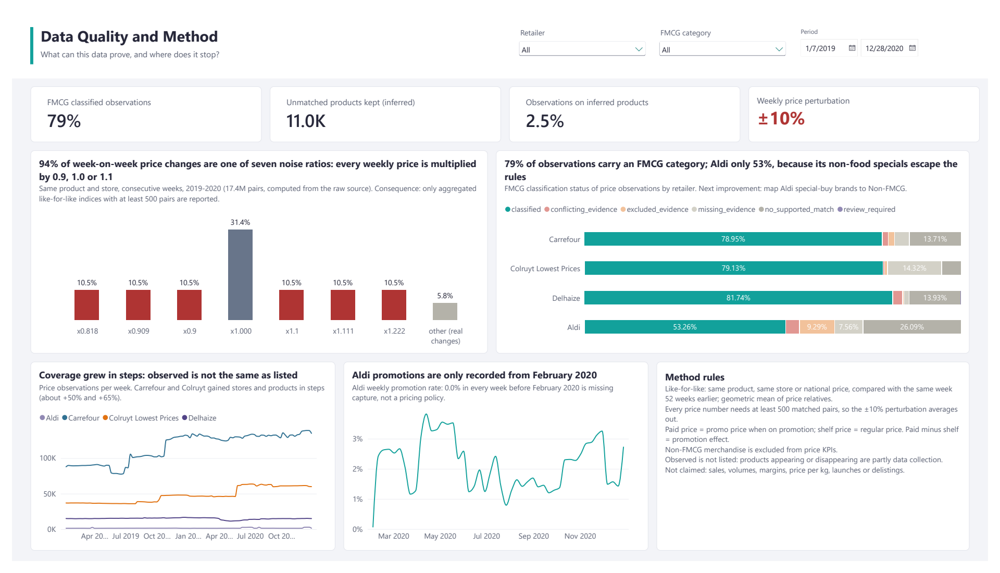
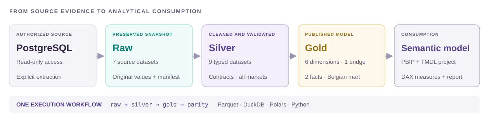

<h1 align="center">Retail pricing & nutrition</h1>
<p align="center"><strong>PostgreSQL → Raw → Silver → Gold → Power BI</strong><br>
An analytics-engineering case for a Belgian FMCG client</p>

A Belgian category manager gets one trustworthy view of how four retailers price, promote
and range their products over two years, and what is in those products, **with every
uncertainty of the source kept visible instead of averaged away**.

| | |
| --- | --- |
| **Scope** | Carrefour, Colruyt Lowest Prices, Delhaize and Aldi · 104 weeks (2019-01-07 to 2020-12-28) |
| **Data** | 21.7M source rows → a Belgian mart of 18.7M weekly prices and 4.3M nutrition rows |
| **Model** | Star schema (2 facts, 6 dimensions) and a Power BI semantic model with 48 DAX measures |
| **Report** | 7 pages that answer the category manager's questions |
| **Trust** | 120 tests · 136 regression checks · byte-identical rebuilds · every rule keeps its evidence |
| **Stack** | Python 3.14 · uv · DuckDB · Polars · Parquet · Power BI (PBIP/TMDL) |

## The report

<table>
  <tr>
    <td width="50%"><a href="docs/assets/report-market-overview.png"></a><br><sub><b>Market Overview</b> · who is priced, where, since when</sub></td>
    <td width="50%"><a href="docs/assets/report-promotional-landscape.png"></a><br><sub><b>Promotional Landscape</b> · how often and how deep are promotions</sub></td>
  </tr>
  <tr>
    <td width="50%"><a href="docs/assets/report-price-evolution.png"></a><br><sub><b>Price Evolution</b> · did like-for-like prices change, and did shoppers pay more than the shelf rose</sub></td>
    <td width="50%"><a href="docs/assets/report-regional-pricing.png"></a><br><sub><b>Regional Pricing</b> · does the same product cost more in some of Carrefour's stores</sub></td>
  </tr>
  <tr>
    <td width="50%"><a href="docs/assets/report-assortment-dynamics.png"></a><br><sub><b>Assortment Dynamics</b> · how much of the range appears, disappears and stays</sub></td>
    <td width="50%"><a href="docs/assets/report-nutrition-benchmark.png"></a><br><sub><b>Nutrition Benchmark</b> · how products compare inside their category</sub></td>
  </tr>
  <tr>
    <td width="50%"><a href="docs/assets/report-data-quality-and-method.png"></a><br><sub><b>Data Quality and Method</b> · what the data and the method allow us to say</sub></td>
    <td width="50%"></td>
  </tr>
</table>

The full model, with its 48 measures, is described in the
[semantic model notes](docs/semantic-model.md).

## Key findings

### About the market

- **Promotions stopped in March 2020** (a two-week Belgian ban on supermarket promotions).
  In the week of 23 March only 16 of 190,344 observations were promotions, all of them
  Aldi. Colruyt restarted after one week, Carrefour after four and Delhaize after five.
- **Shoppers paid more, shelves rose less.** Like-for-like, 2020 against 2019, prices paid
  rose 1.8% and shelf prices 1.2%; in March 2020, 4.1% against 1.2%. By retailer (paid /
  shelf): Delhaize +2.3% / +2.0%, Carrefour +1.7% / +1.1%, Colruyt +1.7% / +1.2%,
  Aldi +0.6% / +1.1%. Meat, poultry & seafood (+5.5%) and frozen (+4.2%) drove it;
  personal and household care stayed flat.
- **Promotion intensity.** Colruyt 8.9% and Carrefour 8.7% of observations are promotions,
  Delhaize 5.5% (Aldi is not comparable). Baby care and cereals are promoted most often;
  personal and household care cut deepest (about 38%).
- **Regional.** Six of Carrefour's nine stores price 2.9% to 4.8% above its national
  online price; three price at it.
- **Assortment.** 53% of Aldi's products are listed four weeks or less, while 39% of
  Colruyt's range is permanent. October 2019 brought 8.2K newly observed products, most
  likely a coverage expansion; Delhaize stopped showing 3.3K online products in April 2020
  and 2.8K were newly observed in June.
- **Nutrition** (UK FSA thresholds): 54% of labelled products are high in at least one of
  fat, saturated fat, sugars or salt. Meat is a salt issue, dairy a saturated-fat issue and
  confectionery a sugar issue.

### About the data

These are measured by the pipeline and they qualify every chart above.

- **Every weekly source price carries a random ±10% perturbation** (factor 0.9, 1.0 or
  1.1; 94% of the week-to-week ratios are one of seven values). A single ratio says
  little, so like-for-like changes are read only over **at least 500 pairs**.
- **16 price contexts, not store networks**: three national base prices and 13 stores
  (Carrefour 9, Colruyt 4). Only Carrefour and Colruyt allow a regional comparison.
- **Coverage grows** (141k observations per week in January 2019, 211k in December 2020),
  so a "new product" is partly scraping coverage. The report says *observed*, never
  *launched* or *delisted*. Aldi's promotions are only collected from February 2020.
- **11,011 products (2.5% of price rows) match no product reference.** They are kept as
  flagged members instead of being dropped.
- **79% of price rows carry an FMCG category**; the rest abstains with a recorded reason.
- **Nutrition** covers 28,201 products, 17,093 of them priced, and the labels are from
  November 2020 to February 2021: read it as a product attribute, not a time series.

### Limitations

**What the data cannot support.** No sales, volumes, margins or promotion uplift (prices
are observations); no price per kilo or litre (weekly prices have no unit or pack size); no
claim that a product appearing or disappearing is a launch or delisting; and the FMCG
category is rule-supported, not verified product by product, so *Non-FMCG / General
Merchandise* is kept out of headline price KPIs.

**What time did not allow.**

- **Forecasting or future trends with machine learning.** The report describes what
  happened in 2019–2020; it does not project prices, promotions or assortment forward.
- **Fuzzy matching to improve the product dimension.** Products are identified by
  `(daltix_id, shop, country)` and never merged across retailers: the same SKU is not the
  same product family, so a fuzzy match on names, brands and pack sizes would need its own
  validation first. The 11,011 unmatched price identities therefore stay separate,
  flagged members.

## How it is built



| Layer | Where | Responsibility |
| --- | --- | --- |
| Raw | `data/raw/` | Untouched copy of the seven source tables, with a checksum manifest. |
| Silver | `data/clean/` | Typed, decoded, flagged datasets for **all markets**; every rule keeps its evidence. |
| Gold | `data/gold/` | The **Belgian client mart**: two facts, six dimensions, a category bridge. |
| Power BI | `semantic_model/` | PBIP/TMDL semantic model and report over the Gold files. |

Parquet is the storage format, DuckDB does the large joins and Polars the small references
and validations. No service or scheduler is needed.

**Core decisions**, each framed for a retail analyst:

- **Retailer codes are decoded once**, at the Raw→Silver boundary. All nine source `shop`
  codes are written backwards (`idla` is `aldi`); unknown codes stop the build.
- **Silver keeps every market; Gold is the Belgian mart.** Nothing is filtered in Raw or
  Silver; Gold drops 5.1M Dutch nutrition rows and every member no Belgian fact uses.
- **Weekly prices are grouped, never "corrected".** Only exact duplicates are removed; a
  week with several distinct prices keeps its range and a flag, and a single price is
  filled only when all observations agree.
- **Every priced product gets a member.** Price identities with no product reference become
  flagged `Unmatched product (<shop> <id>)` members instead of one Unknown row.
- **One FMCG category per product, decided in Silver.** Exact, versioned Dutch merchandise
  rules map category paths to 23 English groups; when the paths cannot decide, the words of
  the product name can; otherwise the product abstains with a reason
  ([how to keep improving it](docs/silver-data-quality.md#improving-the-fmcg-category)).
- **Like-for-like price change** compares the same product in the same place across weeks,
  so mix shift is not read as inflation. The year-on-year ratios are log columns of the
  weekly price row, so any slice is a geometric mean.
- **A build is trusted only when complete.** Silver is staged, validated, moved into place
  and its manifest written last; readers refuse a stale or missing manifest.

| Layer | Object | Rows |
| --- | --- | ---: |
| Raw | seven source tables | 21,663,371 |
| Silver | weekly prices / nutrition / products | 19,075,099 / 9,467,978 / 114,517 |
| Gold | `fact_weekly_prices` / `fact_product_nutrition` | 18,699,187 / 4,334,059 |
| Gold | `dim_product` / `dim_category` / `dim_location` | 113,178 / 6,502 / 16 |

The [Gold notes](docs/gold-model.md#why-gold-has-fewer-rows-than-silver) reconcile every count.

## Run it

Python 3.14 and [uv](https://docs.astral.sh/uv/) are required. The client data is **not** in
the repository (`data/` is git-ignored).

| You want to | Do |
| --- | --- |
| **Read** the project | This page, the three [docs](docs/), and the notebooks in `notebooks/` (their outputs are saved). |
| **Check the code** without data | `uv sync --locked`, then `uv run pytest -q` (no data or credentials needed; a few seconds). |
| **Run everything** | Copy `.env.example` to `.env`, fill in the authorised database settings, then `uv run python -m retail_pricing.pipeline all --rebuild-raw`. |

With Raw already in `data/raw/`, `uv run python -m retail_pricing.pipeline all` rebuilds Silver,
Gold and the regression check (about ten minutes). It clears `data/clean/` and `data/gold/`,
so close Power BI first. Two rebuilds from the same Raw produce byte-identical files.

| Command | Does |
| --- | --- |
| `pipeline raw [--rebuild]` | validate the Raw snapshot, or re-extract it |
| `pipeline silver` | build, validate and publish the nine Silver datasets |
| `pipeline gold` | build, validate and write the Gold mart |
| `pipeline parity [--update-baseline]` | compare the persisted layers with the reviewed baseline |
| `pipeline all [--rebuild-raw]` | all of the above, in order, each stage in its own process |

Also: `uv run ruff check .` and `uv run ruff format --check .`. Notebooks 02 and 03 read the
Silver checkpoint, so run the pipeline first; notebook 01 needs only Raw. To open the report,
set `GoldPath` as described in the [semantic model notes](docs/semantic-model.md#open-and-refresh).

## Technologies learned

I used this case to learn the tools below on a real, messy dataset of 21.7 million rows.

- **Polars.** Column expressions (`pl.col`, `pl.when`) for the cleaning rules, typed nulls, and
  strict joins: `validate="m:1"` makes a join fail instead of silently multiplying rows. I used
  Polars for the small reference tables and the validations, and a lazy `scan_parquet` in the
  integrity checks.
- **DuckDB.** SQL straight on Parquet files: window functions (`ROW_NUMBER`, `COUNT(*) OVER`) to
  pick one nutrition label per product and date and to count price versions, anti joins to find
  unmatched products, `QUALIFY`, and the JSON functions that turn each nutrition label into one
  row per nutrient. The two largest tables are written with `COPY ... TO` Parquet, so their
  millions of rows never pass through Python memory.
- **Optimising file space.** Every layer is Parquet with ZSTD compression: typed, columnar, and
  read only for the columns a query needs. I measured it against the same Raw tables written as
  CSV:

  | Table | Parquet (ZSTD) | Same data as CSV |
  | --- | ---: | ---: |
  | `weekly_prices` (19.2M rows) | 649 MB | about 2.1 GB (3.2× larger) |
  | `nutritionals` (1.1M rows, one JSON label each) | 20 MB | about 880 MB (45× larger) |

  All three layers together take about 1.9 GB (Raw 685 MB, Silver 440 MB, Gold 822 MB). Publishing
  never duplicates data either: Raw uses hard links, and Silver and Gold are built in a staging
  folder and moved into place, with integrity proven by SHA-256 checksums instead of extra copies.

Also used: PostgreSQL (read-only extraction), PyArrow, `uv` for a locked environment, `pytest`
and `ruff`, and Power BI (PBIP/TMDL and DAX).

## Repository map

```text
src/retail_pricing/
  raw.py               source access, extraction, snapshot manifest
  reference.py         reviewed shop codes/names, shop types, nutrient units, Belgian regions
  fmcg_taxonomy.py     versioned English FMCG taxonomy and path rules
  fmcg_name_rules.py   product-name words per FMCG category (mined once, committed)
  quality.py           cleaning helpers, contracts, cross-table checks
  silver_*.py          products · locations · prices · nutrition
  gold.py              dimensions, category model, facts, like-for-like ratio columns
  gold_validation.py   structural Gold contracts (keys, grains, foreign keys, mart scope)
  pipeline.py          one CLI: raw, silver, gold, parity, all
  parity.py            regression check: reviewed row counts, fingerprints and metrics
notebooks/             01 discovery · 02 Silver · 03 Gold (they call src, nothing is re-implemented)
semantic_model/        Power BI PBIP/TMDL project
tests/                 test_raw · test_reference · test_silver · test_gold
docs/                  silver-data-quality · gold-model · semantic-model
```

Details: [Silver data quality](docs/silver-data-quality.md) · [Gold model](docs/gold-model.md) ·
[Semantic model](docs/semantic-model.md).
