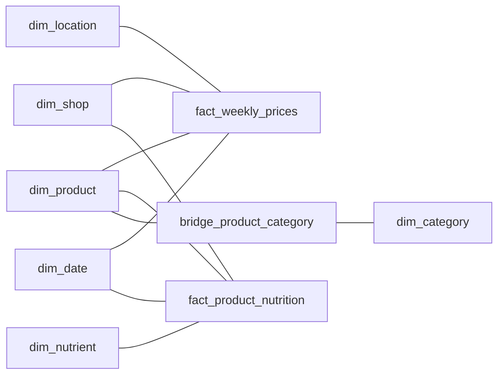

# Gold model

Gold reshapes Silver into a **Belgian client mart**: a star schema for two retail
questions that need different grains — **what shoppers pay** (weekly prices and
promotions) and **what is in the product** (nutrition). Both facts share the Product,
Shop and Date dimensions.

## Why Gold has fewer rows than Silver

Silver keeps every market in the source (Belgium, the Netherlands, Luxembourg,
Germany) so nothing is lost. The client asked about Belgium, so Gold publishes only what
a Belgian analysis can use, and never a member that no fact refers to:

| Object | All markets | Belgian mart | Why |
| --- | ---: | ---: | --- |
| `fact_weekly_prices` | 19,075,099 | 18,699,187 | weekly grouping only; already 100% Belgian |
| `fact_product_nutrition` | 9,467,978 | 4,334,059 | 5,133,919 Dutch rows (Albert Heijn NL, Jumbo) are not part of the Belgian mart |
| `dim_product` | 153,528 | 113,178 | see the reconciliation below |
| `dim_location` | 1,230 | 16 | only locations that have prices |
| `dim_shop` | 7 | 6 | Jumbo has no Belgian product |

Products reconcile exactly: 152,976 identified identities + 551 recovered from prices
= 153,527; minus 25,954 that are not Belgian; minus 25,407 Belgian products that no
fact refers to = **102,166 described members**. Add 11,011 inferred members and the
Unknown member and you get 113,178.

## Published tables

| Table | Rows | Grain / identity |
| --- | ---: | --- |
| `dim_date` | 1,096 | one calendar day, whole years 2019–2021 |
| `dim_shop` | 6 | one retailer code, with its reporting name |
| `dim_product` | 113,178 | `(daltix_id, shop, country)`, 11,011 inferred members and one Unknown member (`-1`) |
| `dim_location` | 16 | `(shop, location)` that has weekly prices, with type and region |
| `dim_nutrient` | 14 | one canonical nutrient and its unit |
| `dim_category` | 6,502 | retailer/country-specific normalised category path |
| `bridge_product_category` | 88,493 | one `(product, category)` membership |
| `fact_weekly_prices` | 18,699,187 | source product × retailer location × week |
| `fact_product_nutrition` | 4,334,059 | product × observation date × nutrient × basis |

Surrogate keys follow the sorted natural identity, so they are repeatable for the
same population but can shift when it changes. Gold is always rebuilt as a whole, and
two rebuilds from the same Raw produce byte-identical files.

## Weekly prices

Silver keeps every distinct price seen in a product-store-week. Gold gives one row per
week and never chooses a price: a single regular, promotional or effective price is
filled in **only when all observations agree**; the range, the number of versions
and variation flags always stay. The effective price is the promo price during a
detected promotion, otherwise the regular price.

| Stage | Rows | Why it changes |
| --- | ---: | --- |
| Raw | 19,218,071 | as extracted |
| Silver | 19,075,099 | 142,972 exact duplicates removed |
| Gold | 18,699,187 | observations grouped per product, store and week |

Of the Gold weeks, 375,912 contain more than one price version, 371,087 have no
single effective price and 35,704 have an uncertain promotion state. A single
effective price exists for 18,328,100 weeks and a discount for 1,554,500. Prices cover
104 weeks (2019-01-07 to 2020-12-28) for Carrefour (10 price contexts), Colruyt
Lowest Prices (4), Delhaize (1) and Aldi (1).

**Like-for-like price ratios.** Three nullable DOUBLE columns sit on the same rows (same
grain, no extra fact table), so the semantic model averages them instead of joining 18.7M
weekly prices at query time:

| Column | Ratio | Rows with a value |
| --- | --- | ---: |
| `log_paid_yoy_ratio` | ln(effective price ÷ effective price of the same product and location 364 days earlier) | 5,645,473 |
| `log_shelf_yoy_ratio` | the same with the regular (shelf) price | 5,647,663 |
| `log_store_vs_national_ratio` | store rows only: ln(effective price ÷ effective price of the same product, retailer and week at the retailer's national online price) | 9,284,071 |

A ratio is NULL when the week a year earlier or the national price is missing, or when
either price is NULL or not above zero; the Unknown product is never compared and a
comparison price that is not unique is ignored, so no join can add a row. Ratios are
natural logs because the geometric mean of price relatives, `exp(mean(log ratio)) - 1`,
then adds up over any slice of weeks, retailers or categories. The gap between the paid
and the shelf change is the effect of promotions: over the whole mart, like-for-like prices
paid rose 1.66% and shelf prices 1.20%.

**The source prices are perturbed.** Every weekly source price carries a random ±10%
factor (0.9, 1.0 or 1.1). 94% of the week-to-week ratios of the same product in the same
store are one of seven values (0.818, 0.9, 0.909, 1, 1.1, 1.111 or 1.222), so a single
ratio says little and the noise only cancels out over many pairs. The semantic model
therefore reports a slice only from **500 pairs**.

**Inferred products.** 476,695 rows (2.55%) belong to 11,011 price identities that no
product reference describes. Instead of hiding them under one Unknown product, each
gets its own member — `Unmatched product (<shop> <id>)`, country `be` (the weekly
pricing process is Belgian), no brand or description — flagged `is_inferred_product`
with FMCG status `missing_evidence`. A price identity never crosses shops (checked), so
the member is unambiguous. Price analysis keeps every row; product analysis can filter
the flag. `product_key = -1` remains for a truly missing id, and there are none.

| Retailer | Inferred rows | Inferred members |
| --- | ---: | ---: |
| Carrefour | 353,195 | 6,383 |
| Colruyt Lowest Prices | 89,781 | 1,414 |
| Delhaize | 21,323 | 1,033 |
| Aldi | 12,396 | 2,181 |

**Price contexts, not a store network.** Only 16 of the 1,230 reference locations have
weekly prices, and Gold keeps exactly those:

| Retailer | Price contexts | Type |
| --- | ---: | --- |
| Carrefour | 1 + 9 | one `Default` national price, nine stores (Brussels 3, Flanders 3, Wallonia 3) |
| Colruyt Lowest Prices | 4 | stores: Halle, Ans, Anderlecht, Beveren |
| Delhaize | 1 | `Default` national price |
| Aldi | 1 | `Default` national price |

`location_type` is *National price (online)* for a `Default` / base context with no
address or coordinates (a reviewed reading, not a source fact) and *Store* otherwise.
`region` is derived from the Belgian postcode ranges only (1000–1299 Brussels,
1300–1499 Wallonia, 1500–3999 Flanders, 4000–7999 Wallonia, 8000–9999 Flanders); a
store without a postcode (Anderlecht and Beveren) stays NULL rather than guessed. Prices
from a national context are never copied to stores. A map therefore shows
*observed price coverage* of 13 stores, never national coverage. Only Carrefour and
Colruyt have more than one context, so regional comparisons exist for those two only.
The Swedish `aldi / filipstad` record is flagged `dq_outside_benelux` in Silver and
disappears from Gold because it has no prices.

## Product nutrition

One row per product, observation date, nutrient and portion basis. Per-100 g and
per-100 ml values are never mixed. Values with an incompatible unit keep their row
with a NULL canonical value (67 rows), and `is_value_usable` means only that a
canonical value exists. Nutrition covers 28,201 Belgian products of five retailers
(Carrefour, Albert Heijn, Colruyt, Delhaize, Collect&Go) between 2020-11-27 and
2021-02-24, while pricing ends 2020-12-28, so combined analysis is limited to
2020-11-27 – 2020-12-28. Only 17,093 of the 102,069 priced products have nutrition.

Each label is scraped repeatedly (on average 17.8 observation dates per product,
nutrient and basis). `is_latest_observation` marks the most recent date of every product, nutrient
and basis (243,673 rows), so benchmarks weigh a product once instead of once per download.

## Product and category

- **Descriptions.** Weekly product values win; a matching products record fills a
  missing name, brand or description field by field.
- **English FMCG category.** Decided once in Silver (see the
  [Silver notes](silver-data-quality.md#categories-and-the-english-fmcg-category))
  and attached to Product with its status and mapping version (`fmcg_v3`). The retailer
  category paths decide first and the product name is the backup when the paths cannot.
  70,159 members are `classified` (68.7% of the 102,166 described members and 81.1% of
  the price rows they carry); the rest carry an explicit reason: 25,158 without evidence
  (11,011 of them inferred), 10,273 without a matching rule, 6,092 with only unusable
  paths, 1,456 with conflicting evidence and 39 withheld for review. This is the
  category to compare across retailers.
- **Retailer categories.** Only paths that are not duplicates, ancestors, site
  navigation or repeated labels reach Gold: 88,493 eligible product-path pairs become
  as many memberships in 6,502 categories, for 83,994 products (3,527 with several). The bridge keeps multiple memberships without multiplying a fact. 26
  products keep a shorter and a longer path from different sources because no reviewed
  rule says which is obsolete. Category totals overlap and must not be added; the
  Power BI report uses the FMCG category instead.

### English FMCG groups in Product

| Group | Members | Group | Members |
| --- | ---: | --- | ---: |
| Other / Unclassified | 43,019 | Household Care | 4,878 |
| Non-FMCG / General Merchandise | 12,211 | Dairy & Eggs | 4,508 |
| Personal Care & Hygiene | 7,558 | Meat, Poultry & Seafood | 3,176 |
| Alcoholic Beverages | 7,364 | Non-Alcoholic Beverages | 2,804 |
| Pantry & Cooking | 6,572 | Frozen Foods | 2,647 |
| Confectionery & Snacks | 5,958 | Fresh Produce | 2,045 |
| Beauty & Cosmetics | 1,947 | Pet Care | 1,916 |
| Coffee & Tea | 1,399 | Chilled & Prepared Foods | 1,367 |
| Baby Care | 1,268 | Bakery | 1,072 |
| Breakfast & Cereals | 615 | Household Paper & Supplies | 408 |
| Tobacco | 169 | Health & Wellness | 129 |
| Plant-Based Alternatives | 148 | | |

Coverage of the **price rows** by retailer: Delhaize 81.7%, Colruyt Lowest Prices 79.1%,
Carrefour 79.0%, Aldi 53.3% (79.0% overall, including the inferred rows). Classified
share of the **described members** is lower for retailers whose websites expose little
category evidence: Delhaize 82.9%, Carrefour 80.5%, Colruyt 71.1%, Aldi 23.2%,
Collect&Go 22.1%, Albert Heijn 21.1%. This reflects the evidence each site exposes, not
retailer quality. Compare like-for-like populations and show the unclassified share
next to any category view. *Non-FMCG / General Merchandise* (electronics, stationery,
linen, toys, gift cards) is part of the same mart; exclude it, or filter to the FMCG
groups, before reading a headline average price.

## Checks

`validate_gold_model` runs before anything is written and checks structure that must
hold for any snapshot: unique surrogate and natural keys, category bridge integrity,
fact grains, foreign keys, mart scope (one market, no unused member, no identity
across shops, valid location types) and the latest-observation flag. It holds no
snapshot-specific number. Row counts and reviewed metrics live in
`parity_baseline.json`; after publication `parity` compares the persisted files with
it (see the [README](../README.md#run-it)). Gold is written file by file, so an
interrupted run must be repeated before the files are used.

## Not supported by these data

No sales, volumes, margins or promotion uplift can be derived from observed prices.
Weekly prices have no unit or pack size, so there is no €/kg. Observed appearance and
disappearance of a product is partly scraping coverage, not a launch or delisting:
weekly rows per retailer vary widely (Carrefour 77.6k–139k, Aldi 1.3k–2.9k).
