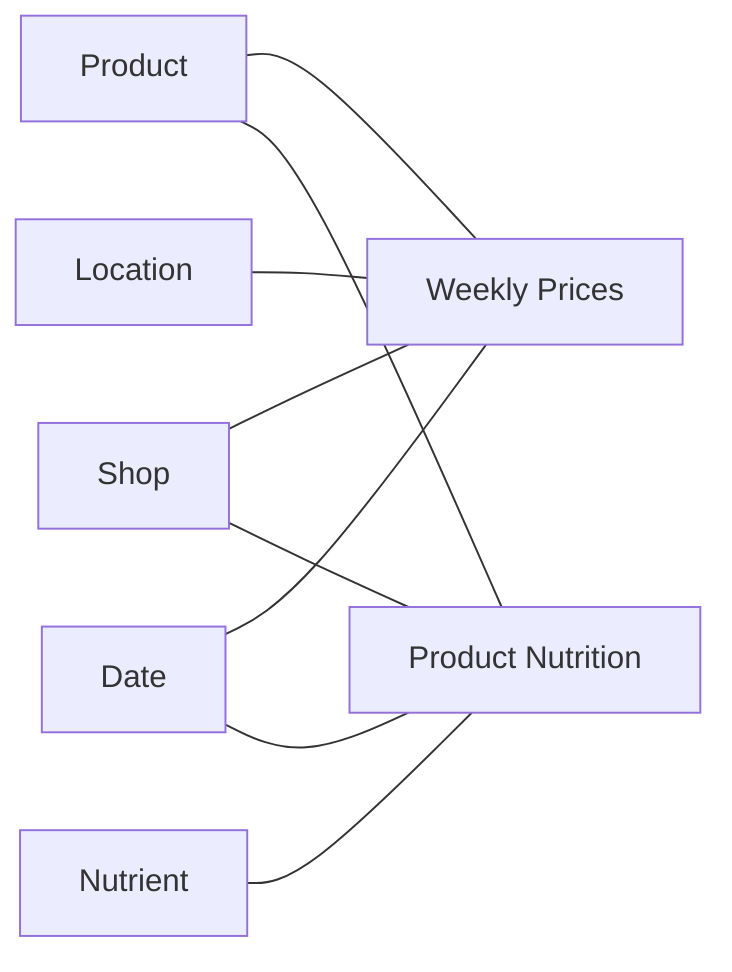

# Semantic model

The Power BI project in [`semantic_model/`](../semantic_model/) imports the Gold files
and exposes them as a report-ready model. Business cleaning stays in the pipeline;
Power BI holds relationships, hierarchies and measures. The project is version-controlled as
PBIP/TMDL, so tables, relationships and DAX are reviewable in Git.

## Tables and relationships

| Power BI table | Gold source | Role |
| --- | --- | --- |
| Weekly Prices | `fact_weekly_prices` | price and promotion fact (hidden keys) |
| Product Nutrition | `fact_product_nutrition` | nutrition fact (hidden keys) |
| Product, Shop, Date | `dim_product`, `dim_shop`, `dim_date` | shared by both facts |
| Location | `dim_location` | prices only; type, region and a `Geography` hierarchy |
| Nutrient | `dim_nutrient` | nutrition only |
| Price Noise Evidence | none (static `DATATABLE`) | distribution of week-on-week price ratios, see below |

There are 8 relationships, all single-direction from a fact to its dimension. **The FMCG
category lives on Product** (`Primary FMCG Category`, `Classification Status`,
`Inferred Product`), decided once in Silver, so every report page slices by the same
23 groups. The retailer category tree (`dim_category` and its bridge) stays in Gold as
evidence but is *not* loaded: its memberships overlap, and a bidirectional bridge would
make totals non-additive. Technical keys are hidden; `Product` has a
`Brand → Product` hierarchy and `Date` a `Calendar` hierarchy.

## Measures

The model holds 48 DAX measures (46 visible) in display folders: base counts and
coverage, promotions, price evolution, assortment, regional pricing and data quality on
`Weekly Prices`; base counts, benchmarks, category benchmarks and nutrient flags on
`Product Nutrition`. Two colour helpers sit in a hidden `90 Formatting` folder. The report
has seven pages: Market Overview, Promotional Landscape, Price Evolution, Regional
Pricing, Assortment Dynamics, Nutrition Benchmark, and Data Quality and Method.

Conventions that run through the measures:

- **Like-for-like, at least 500 pairs.** Price change compares the same product in the
  same location across two weeks, so a mix shift does not read as inflation. The
  year-on-year measures (`(Period)`) average the ratio columns of Gold
  `fact_weekly_prices` (`log_paid_yoy_ratio`, `log_shelf_yoy_ratio`,
  `log_store_vs_national_ratio`) as `EXP(AVERAGE(log ratio)) - 1`, the geometric mean of
  price relatives, and stay blank below 500 pairs: every weekly source price carries a
  random ±10% perturbation that only cancels out over many pairs (see the
  [Gold notes](gold-model.md#weekly-prices)). The year-on-year lag is 364 days (the same
  weekday 52 weeks earlier).
- **Paid versus shelf.** The paid price is the effective price, the shelf price the
  regular one; paid minus shelf change is the effect of promotions.
  `Matched YoY Price Change % (Period)` and `Matched YoY Regular Price Change %
  (Period)` give the two, `Promotion Effect on Paid Price (pp)` their difference.
- **Non-FMCG is kept out of price KPIs.** The Price Evolution page filters out
  *Non-FMCG / General Merchandise* (electronics, linen, gift cards), which would distort
  an average price.
- **Monthly assortment.** `Newly Observed Products (Month)` and `No Longer Observed
  Products (Month)` compare each calendar month with the previous one (the page shows the
  monthly averages entering and leaving); `Core Range Share` is the share of products
  listed in at least 90% of the weeks.
- **Observed, not sold.** Products entering or leaving the range are partly scraping
  coverage; weekly rows per retailer vary widely, so they are not launches or delistings.
- **Nutrition benchmarks weigh a product once.** Averages use each product's latest
  observation (`Latest Observation`), and the category benchmark takes the equal-weight
  mean of those products in the selected FMCG category. The nutrient flags ignore the Date
  filter because labels were scraped on other dates than prices.
- **Nutrient flags use the UK FSA front-of-pack thresholds** per 100 g: fat 17.5,
  saturated fat 5, sugars 22.5 and salt 1.5 g; half of each per 100 ml for drinks. A
  product counts as "high" on its latest usable label.
- **Static evidence table.** `Price Noise Evidence` is a `DATATABLE` with the
  distribution of week-on-week regular price ratios of the same product and location
  over 2019–2020 (17.4M pairs from Raw); 94% are one of seven values. It is static and
  must be recomputed if the source changes.

## Open and refresh

1. Build the Gold files (`uv run python -m retail_pricing.pipeline all`).
2. Set the `GoldPath` parameter in
   [`expressions.tmdl`](../semantic_model/retailpbi.SemanticModel/definition/expressions.tmdl)
   to the absolute `data/gold` folder of your checkout; the checked-in default is the
   author's path.
3. Open [`retailpbi.pbip`](../semantic_model/retailpbi.pbip) in Power BI Desktop, then
   refresh. Close Power BI before rebuilding Gold: the pipeline deletes and rewrites
   the files it reads.

After a refresh the Market Overview cards must match Gold: **Price observations** equals
the rows of `fact_weekly_prices` (18,699,187, shown as 18.7M), **Retailers** is 4 and
**Price contexts** is 16. On Price Evolution, paid +1.8%, shelf +1.2% and +0.6 pp.

## Limits

The price map plots only locations with coordinates and observations, that is 13 stores;
the three national base prices have no coordinates. It shows observed price coverage,
not the retailer network. `Observed Products` counts dimension members, so an inferred
`Unmatched product (...)` counts as one product. Python checks validate the data layers;
they do not prove a successful Power BI refresh or the DAX.
